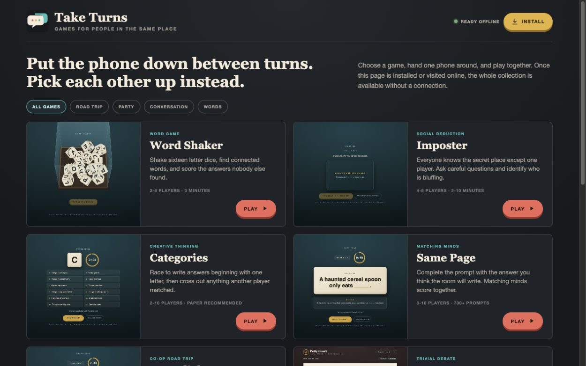
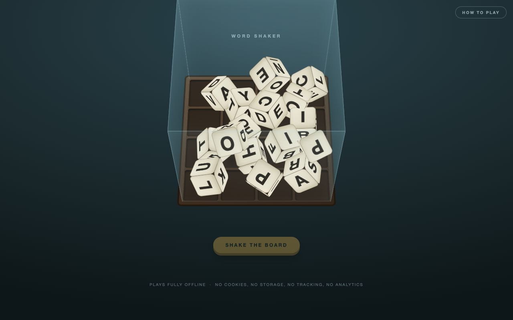
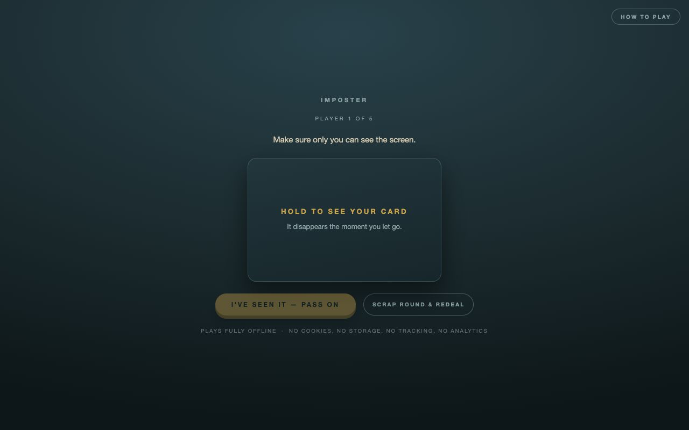
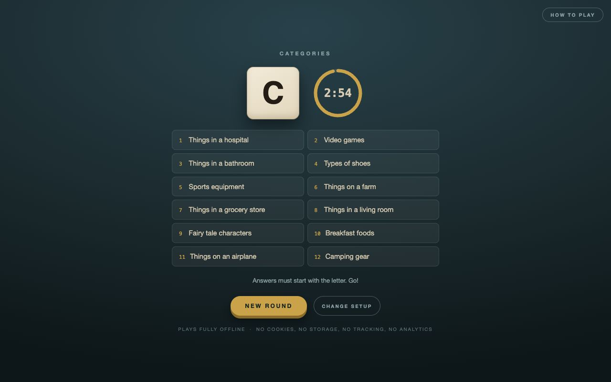
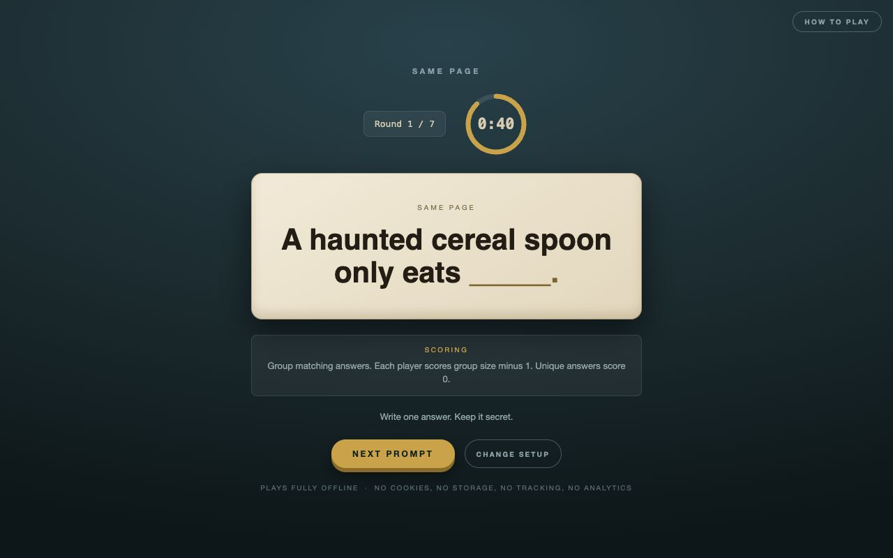
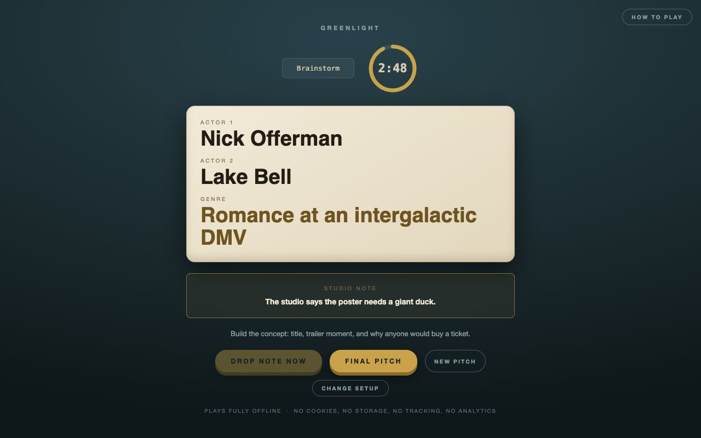
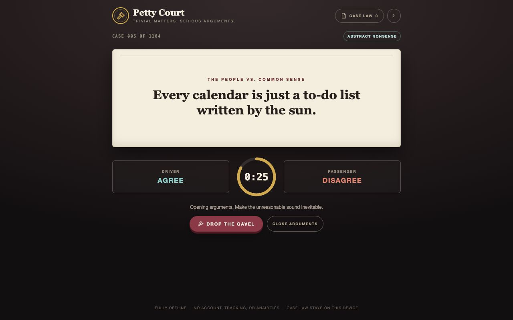
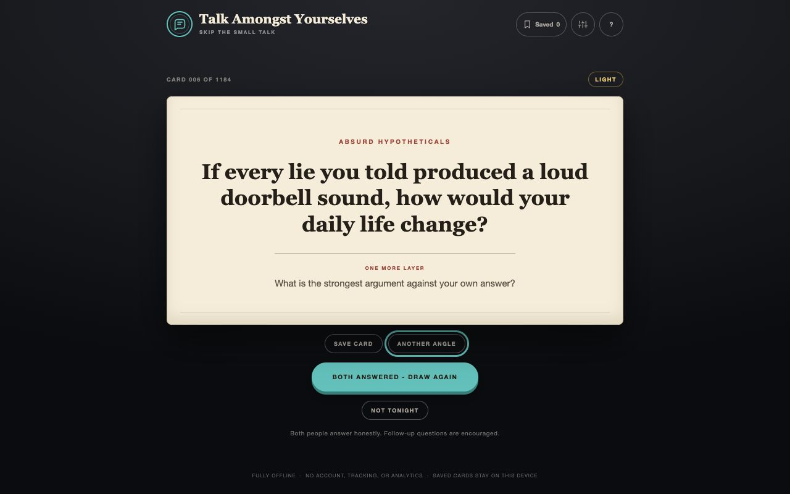
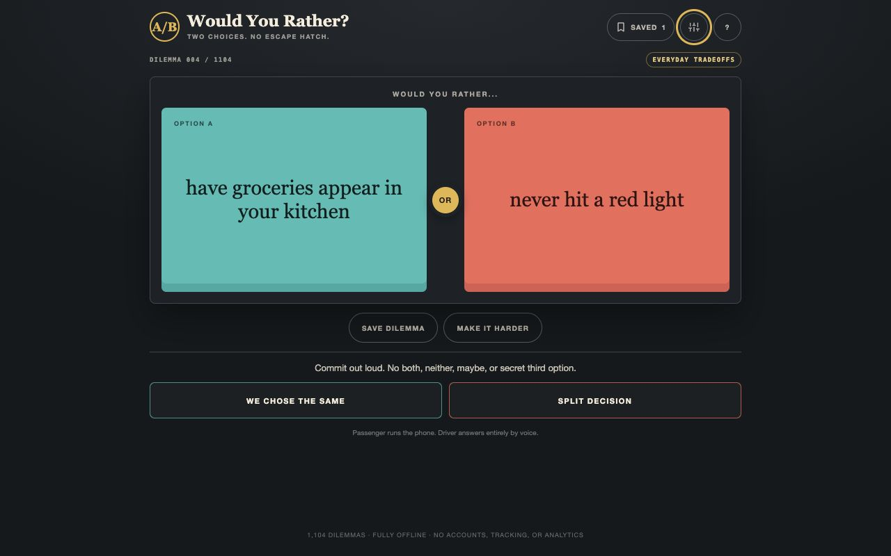
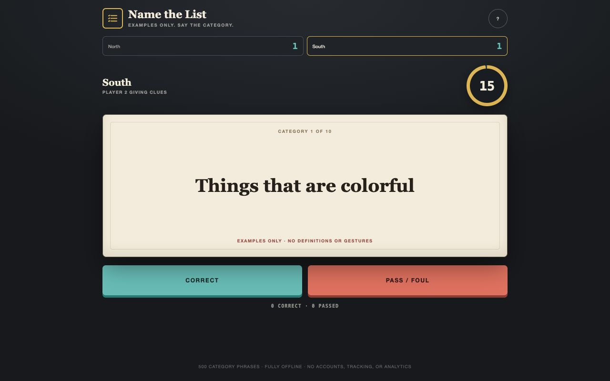

# Take Turns

Offline multiplayer games for face-to-face fun. No accounts, ads, tracking, or analytics.

## Play

**[Open the game launcher](https://taketurns.fun/)**

Choose a game and start playing. On a phone, use **Install App** or **Add to Home Screen** from the browser menu. Visit the launcher once while online and all nine games are cached for later use without a connection.

The games are ordinary web pages, so there is nothing to buy and no app-store account is required. Clearing browser storage can remove the offline copy; reconnecting and opening the launcher restores it.

## Games

<table>
  <tr>
    <td width="50%">
      <h3><a href="word-shaker/word-shaker.html">Word Shaker</a></h3>
      
      
Shake sixteen letter dice, find connected words, and score what nobody else found. Best for 2-8 players.

    </td>
    <td width="50%">
      <h3><a href="imposter/imposter.html">Imposter</a></h3>
      
      
One secret place and one player who has no idea where they are. Best for 4-8 players.

    </td>
  </tr>
  <tr>
    <td width="50%">
      <h3><a href="categories/categories.html">Categories</a></h3>
      
      
One letter, a list of categories, and a race to write unique answers. Best for 2-10 players.

    </td>
    <td width="50%">
      <h3><a href="same-page/same-page.html">Same Page</a></h3>
      
      
Complete the prompt with the answer you think the room will write. Includes 700+ prompts.

    </td>
  </tr>
  <tr>
    <td width="50%">
      <h3><a href="greenlight/greenlight.html">Greenlight</a></h3>
      
      
A co-op road-trip movie pitch ruined, helpfully, by a studio note. The driver plays entirely by voice.

    </td>
    <td width="50%">
      <h3><a href="petty-court/petty-court.html">Petty Court</a></h3>
      
      
Debate 1,184 aggressively trivial cases and swap sides when the Gavel drops.

    </td>
  </tr>
  <tr>
    <td width="50%">
      <h3><a href="talk-amongst-yourselves/talk-amongst-yourselves.html">Talk Amongst Yourselves</a></h3>
      
      
Skip the small talk with 1,184 funny, revealing, nostalgic, and mildly existential questions.

    </td>
    <td width="50%">
      <h3><a href="would-you-rather/would-you-rather.html">Would You Rather?</a></h3>
      
      
Make a forced choice from 1,104 dilemmas, then defend it when the game makes the decision harder.

    </td>
  </tr>
  <tr>
    <td width="50%">
      <h3><a href="name-the-list/name-the-list.html">Name the List</a></h3>
      
      
Give examples until your teammate names the category. Includes 500 phrases, timed team turns, and automatic tie rounds.

    </td>
    <td width="50%">
      <h3>Private by design</h3>
      
Every game runs entirely on the device. Saved cards, scores, seen-card history, and Case Law remain in that browser. Nothing is sent to a server.

    </td>
  </tr>
</table>

## How Offline Play Works

The launcher registers a service worker that downloads the launcher, every game, the screenshots, and the app icons into the browser cache. After that first successful visit, the same URL works in airplane mode. When the site changes, reconnect and reopen the launcher to receive the updated cache.

GitHub Pages serves the repository as a static HTTPS website. The individual games remain self-contained HTML files and can also be opened directly from a local copy of the repository.

---

Made for gathering, not scrolling.
