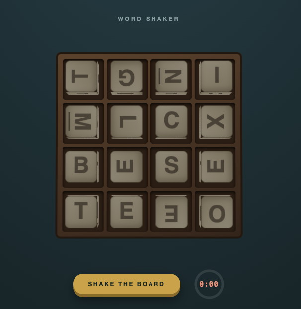

# Word Shaker

A self-contained, offline-friendly word dice game designed for **real-world play**.

## The Idea

Put the phone in the middle of the table. Everyone plays together.

No "find other players." No "join a game." No entering words into the app. This isn't a multiplayer game — it's a **tool for a shared experience**.

- Shake the board to roll the 16 dice
- A 3-minute timer begins
- Everyone writes down every word they can spot
- When time's up, compare lists and score what's unique to you

Perfect for family game night, road trips, airplane rides, or anywhere you want to play with people who are *actually there*.

## How to Use

1. **Open** `word-shaker.html` in any modern web browser
2. **Shake** the board and place the device in the center of the table
3. **Play** — pencil and paper required, words formed from adjacent letters
4. **Score** when the timer ends (cross out any word found by two or more players)

### Scoring

| Letters | Points |
|---------|--------|
| 3–4     | 1      |
| 5       | 2      |
| 6       | 3      |
| 7       | 5      |
| 8+      | 11     |

## Play Anytime, Anywhere

Word Shaker runs **entirely on your device**:

- No internet connection required
- No cookies, no storage, no tracking, no analytics
- Works fully offline once saved

### Saving to Your Device

**On your phone:** Open the page, then use "Save to Home Screen" (iOS) or "Add to Home Screen" (Android) to have it always available — even on an airplane.

**On your computer:** Save the HTML file somewhere convenient and open it in any browser.

## Tech Notes

Built with vanilla HTML, CSS, and JavaScript — no frameworks, no dependencies. Features a custom 3D physics simulation for the dice shake using quaternions, CSS 3D transforms for rendering, and the Web Audio API for the end-of-round chime.

The `Qu` die counts as two letters. Underlined letters (M, W, N, Z) indicate orientation.

## License

Free to use and enjoy. No warranties, but lots of fun intended.
